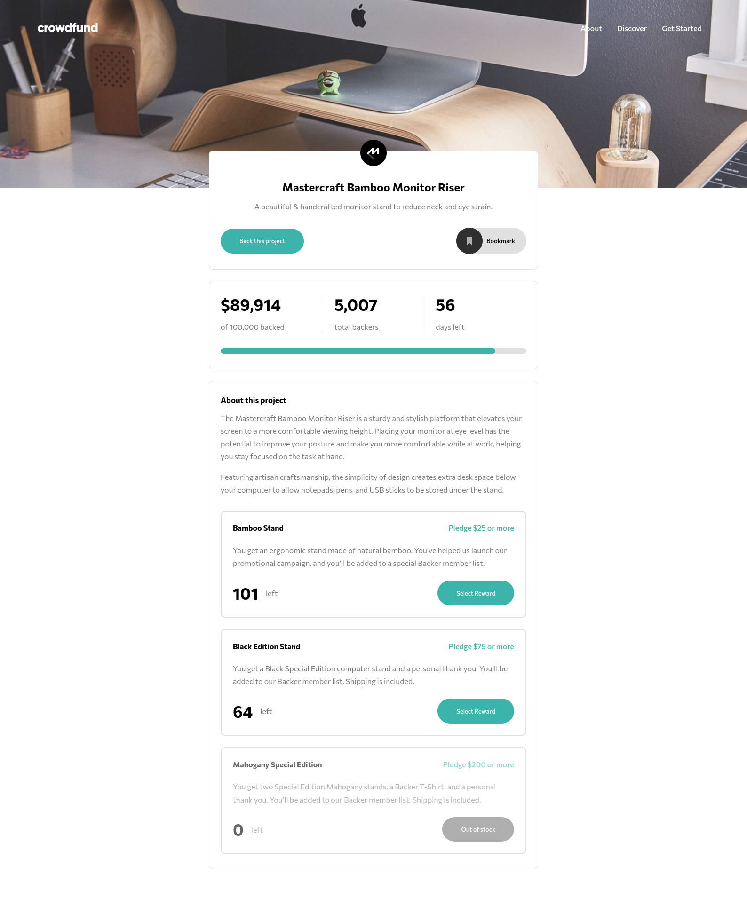
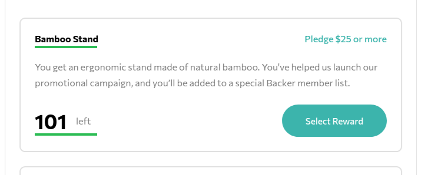
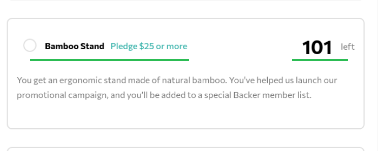

# Frontend Mentor - Blogr landing page solution

This is a solution to the [Blogr landing page challenge on Frontend Mentor](https://www.frontendmentor.io/challenges/blogr-landing-page-EX2RLAApP). Frontend Mentor challenges help you improve your coding skills by building realistic projects.

## Table of contents

- [Overview](#overview)
  - [The challenge](#the-challenge)
  - [Screenshot](#screenshot)
  - [Links](#links)
- [My process](#my-process)
  - [Built with](#built-with)
  - [What I learned](#what-i-learned)
  - [Continued development](#continued-development)
  - [Useful resources](#useful-resources)
- [Author](#author)

## Overview

### The challenge

Users should be able to:

- View the optimal layout for the site depending on their device's screen size
- See hover states for all interactive elements on the page

### Screenshot



### Links

- Solution URL: [https://github.com/NDOY3M4N/crowdfunding-product-page](https://github.com/NDOY3M4N/crowdfunding-product-page)
- Live Site URL: [https://ndoy3m4n.github.io/crowdfunding-product-page/](https://ndoy3m4n.github.io/crowdfunding-product-page/)

## My process

### Built with

- Semantic HTML5 markup
- SASS and some CSS custom properties
- Flexbox
- CSS Grid
- Mobile-first workflow
- Vanilla Javascript

### What I learned

In the design, the item card in the main page is kinda similar to the item card on the modal. So I thought to myself why not use the same markup. But then I realized that the disposition of certain element is not the same.

ITEM MAIN             |  ITEM MODAL
:-------------------------:|:-------------------------:
  |  

As you can see the header and the footer of our items are not the same. So I come up with this markup:

```html
<div class="item item--main" id="bamboo">
  <div class="item__header">
    <div class="item__header__title">Bamboo Stand</div>
    <div class="item__header__pledge">Pledge $25 or more</div>
  </div>
  <div class="item__desc">
    <p>You get an ergonomic stand made of natural bamboo. You've helped us launch our promotional campaign, and you’ll be added to a special Backer member list.</p>
  </div>
  <div class="item__footer">
    <div class="item__footer__stock">
      <h1>101</h1>
      <p>left</p>
    </div>
    <button class="btn" data-pledge="pledgeBambooStand">Select Reward</button>
  </div>
</div>
```

```html
<div class="item item--modal">
  <div class="item__header">
    <div class="item__header__radio">
      <input type="radio" name="radioPledge" id="pledgeBambooStand">
      <span class="custom-radio"></span>
    </div>
    <label for="pledgeBambooStand" class="item__header__title">Bamboo Stand</label>
    <div class="item__header__pledge">Pledge $25 or more</div>
  </div>
  <div class="item__desc">
    <p>You get an ergonomic stand made of natural bamboo. You've helped us launch our promotional campaign, and you’ll be added to a special Backer member list.</p>
  </div>
  <div class="item__footer">
    <div class="item__footer__stock">
      <h1>101</h1>
      <p>left</p>
    </div>
    <form action="#" class="item__footer__action">
      <p>Enter your pledge</p>
      <div action="#" class="item__footer__action__checkout">
        <div class="item__footer__action__checkout__input">
          <span class="unit">$</span>
          <input type="number" name="pledgeMoney" min="25" value="25" data-item="bamboo-stand">
        </div>
        <button class="btn">Continue</button>
      </div>
    </form>
  </div>
</div>
```

Here's the SASS for these classes (sorry for the long sass code :sob:):

```scss
/* Style for an item */
.item {
  --border-width: 2px;
  --padding: 1.5rem;
  @extend .card; // some padding and margin styles

  &.selected { border-color: var(--light-cyan); }
  & > * + * { margin-top: 1.5rem; }

  &__header {
    &__title {
      font-weight: 700;
      cursor: pointer;
      @include mixins.transition(color, .4s);
    }

    &__pledge {
      font-weight: 500;
      color: var(--light-cyan);
    }
  } /* end of .item__header */

  &__footer {
    &__stock {
      display: flex;
      align-items: center;

      h1 {
        margin-bottom: 0;
        margin-right: 1rem;
      }
    }
  } /* end of .item__footer */


  /* Style for a basic item (item shown in the main element)*/
  &--main {
    .item__header > * + * { margin-top: .5rem; }
    .item__footer > * + * { margin-top: 1.5rem; }

    .item__header,
    .item__footer {

      @include mixins.screen('small') {
        display: flex;
        align-items: center;
        justify-content: space-between;

        & > * + * { margin-top: 0; }
      }
    }
  } /* end of .item--main */

  /* Style for a complex item (item shown in the modal element)*/
  &--modal {
    --padding: 1.5rem 0;

    & > *:not(.item__footer) { padding: 0 1rem; }

    &.selected {
      .item__footer__action { display: block; }
    }
    @include mixins.screen('small') {
      &.selected {
        .item__footer__action { display: flex; }
      }
    }

    .item__header {
      display: grid;
      grid-template-columns: 48px 1fr;
      grid-template-rows: 20px 20px;
      column-gap: .2rem;
      row-gap: .5rem;

      &__title { /* shamelessly copied from tailwindcss */
        overflow: hidden;
        text-overflow: ellipsis;
        white-space: nowrap;
      }

      &__radio {
        grid-row: 1 / -1;
        position: relative;
        cursor: pointer;
        user-select: none;

        input[type="radio"] {
          position: absolute;
          opacity: 0;
          width: 24px;
          height: 24px;
          transform: translate(50%, 50%);
          z-index: 5;

          & + .custom-radio {
            position: absolute;
            left: 0;
            top: 0;
            width: 24px;
            height: 24px;
            border: 2px solid var(--light-gray);
            border-radius: 50%;
            background-color: transparent;
            transform: translate(50%, 50%);
            @include mixins.transition(border, .4s);
          }

          &:checked + .custom-radio:after {
            content: '';
            position: absolute;
            top: 0;
            left: 0;
            right: 0;
            bottom: 0;
            margin: .25rem;
            border-radius: 50%;
            background-color: var(--light-cyan);
          }
        }
      } /* end of .item__header__radio */

      &:hover {
        .item__header {
          &__title { color: var(--light-cyan); }
          &__radio input + .custom-radio { border: 2px solid var(--light-cyan); }
        }
      }

      &--no-reward .item__header__title {
        grid-row: 1 / -1;
        align-self: center;
      }

      @include mixins.screen('small') {
        grid-template-columns: 48px max-content max-content;

        &__title,
        &__pledge {
          grid-row: 1 / -1;
          align-self: center;
        }

        &__pledge { margin-left: .5rem; }
      }
    } /* end of .item__header (modal) */

    .item__footer {
      &__stock { padding: 0 1rem; }

      &__action {
        border-top: 1px solid var(--light-gray);
        margin-top: 1rem;
        text-align: center;
        padding: 1.5rem 1rem 0;
        display: none;

        &__checkout {
          display: grid;
          grid-template-columns: repeat(2, 1fr);
          gap: .5rem;
          margin-top: 1rem;

          &__input  {
            position: relative;

            input[type="number"] {
              font-weight: 700;
              text-align: center;
              border: 2px solid var(--light-gray);
              border-radius: 10rem;
              padding: 1.25rem;
              width: 100%;
              -moz-appearance: textfield;

              &::-webkit-outer-spin-button,
              &::-webkit-inner-spin-button {
                -webkit-appearance: none;
                margin: 0;
              }

              &:focus {
                outline: none;
                border: 2px solid var(--light-cyan);
              }
            }

            span.unit {
              position: absolute;
              top: 50%;
              left: 0;
              transform: translateY(-50%);
              margin-left: 1.5rem;
              margin-top: -1px;
              font-weight: 700;
              color: var(--dark-gray);
            }
          }
        }

        @include mixins.screen('small') {
          text-align: left;
          align-items: center;
          justify-content: space-between;

          &__checkout {
            margin-top: 0;
            flex: 0;
            &__input { width: 100px; }
          }
        }
      }
    } /* end of .item__footer (modal) */

    @include mixins.screen('small') {
      position: relative;

      .item__footer__stock {
        position: absolute;
        top: 2rem;
        right: 0;
        display: inline-flex;
      }
    }
  } /* end of .item--modal */
}
```

### Continued development

In my Sass files I tried to use the BEM notations for my class but I'm pretty sure I'm not using it correctly. Also I would like if I have some time to refactor my javascript code, specially the part where the user try to pledge.

### Useful resources

- [How to create a custom checkbox](https://www.w3schools.com/howto/howto_css_custom_checkbox.asp) - This helped me with the custom checkbox.

## Author

- Frontend Mentor - [@NDOY3M4N](https://www.frontendmentor.io/profile/NDOY3M4N)
- Twitter - [@NDOY3M4N](https://twitter.com/NDOY3M4N)

